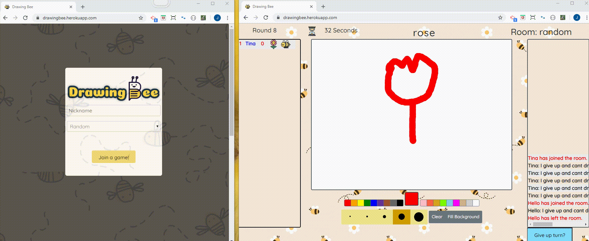
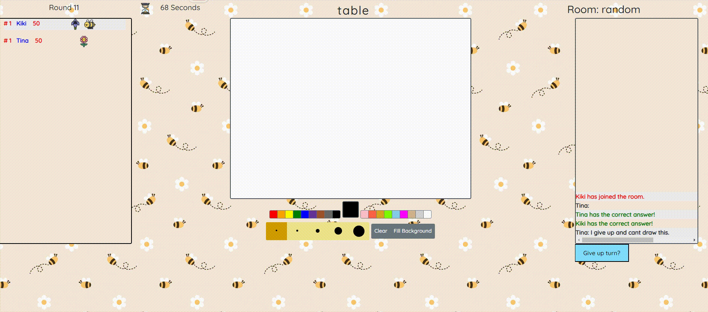
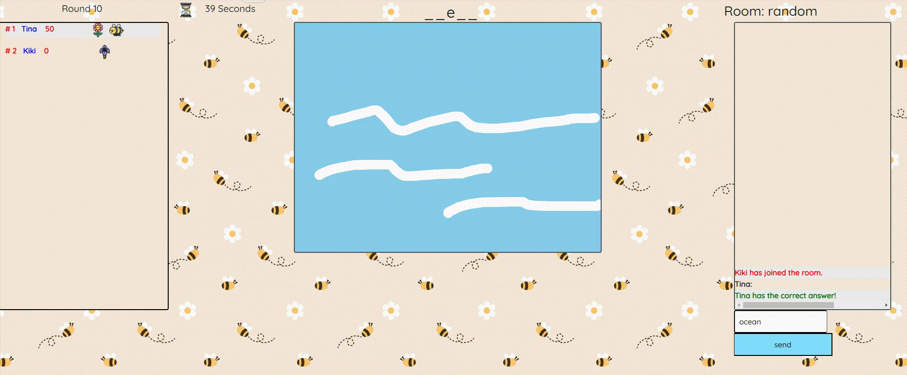

<h1 align="center"> Welcome to DrawingBee Online Game   </h1>  

## Deployment 
### 🏠 [DrawingBee](https://drawingbee.herokuapp.com/)

## Author
- Github: [@Jing](https://github.com/redbubble-ash), [@RuYing](https://github.com/rychenf1), [@Richard](https://github.com/RichardsTomorrow)

## Game Intro

<h5>
DrawingBee is a fun online drawing game. You can join a room or create your own rooms to play with your friends! 
</h5>
 
<h5>
To start a game, simply login by providing a user name and selecting one of the room options. Players take turns drawing different things (drawer) while other players (guessers) try to guess what the drawing is. The turn ends when the time runs out. If the word was guessed correctly, the guesser rewards scores. The round score will be displayed at the end of each game. The rank and total score will be displayed on the score board. 
</h5>

## Features


## Technologies

* HTML
* CSS
* Javascript
* JQuery
* Canvas
* MySQL
* Express.js
* socket.io
* Path.js
* Nodemon.js
* Heroku

## Install

Start by installing front and backend dependencies. While in this directory, run the following command:

```sh
npm install
```

This should install node modules within the server and the client folder.

After both installations complete, run the following command in your terminal:

```
npm run dev
```

Your app should now be running on http://localhost:3000. 

## Login Page



## Drawer



## Guesser


